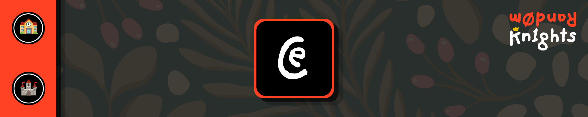
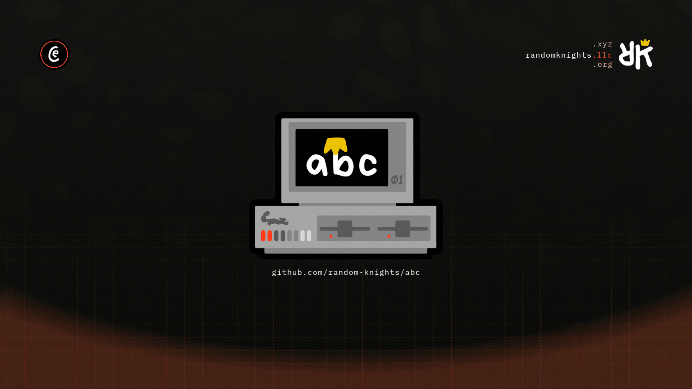

<!-- PROJECT LOGO -->
 

  <picture>
    
  </picture>

<h3 align="center" style="color:#ff4124">Random Knights, XYZ - c1assr00m</h3>

## What it is

[C1assr00m](https://c1assr00m.rand0m.ai) is a structured learning environment:
an intro to development, AI, automation, and S.T.E.A.M. through guided
missions and hands-on practice. Learning modules live as organized folders so
students progress step-by-step in one unified workspace, with a pathway into
the wider Rand0m projects.

  

## Quickstart

Browse the mission folders in order; each module contains its own
instructions and exercises. Open a focused issue or pull request in the
public project queue for questions or fixes.

## Docs

Ecosystem docs (architecture, ADRs, runbooks, conventions) live in
**[xyz-docs](https://github.com/random-knights/xyz-docs)** (start at
`INDEX.md`). Public-facing docs:
[READMORE](https://github.com/random-knights/.github/blob/main/READMORE).

## Operating this repo

- [RUNBOOK.md](RUNBOOK.md) - humans: how this repo works, what breaks and how to
  fix it. No build, no toolchain, no secrets.
- [AGENTS.md](AGENTS.md) - agents: the rules that apply in this repo.
