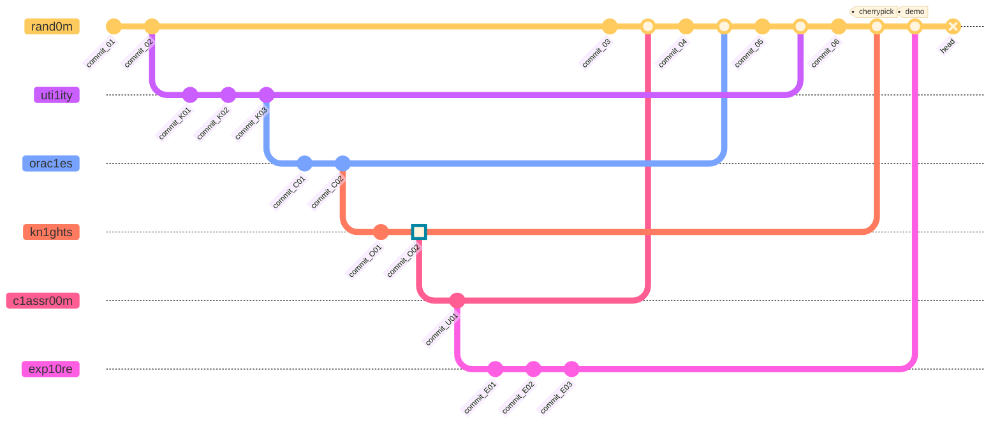
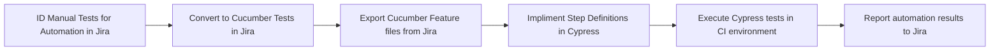

<!-- PROJECT LOGO -->
 

  <picture>
    <source media="(prefers-color-scheme: dark)" srcset="https://github.com/random-knights/.github/blob/main/assets/ruok-drk.gif">
    <source media="(prefers-color-scheme: light)" srcset="https://github.com/random-knights/.github/blob/main/assets/ruok-lte.png">
    
  </picture>

<h3 align="center" style="color:#ff4124">Random Knights, XYZ</h3>

  

    rand0m.ai & randomly.engineering
     
    <a href="https://github.com/random-knights/.github/blob/main/READMORE"><strong>Explore the docs »</strong></a>
     
     
    <a href="https://github.com/random-knights/rand0m">View Demo</a>
    ·
    <a href="https://github.com/random-knights/rand0m_bug/issues">Report Bug</a>
    ·
    <a href="https://github.com/random-knights/rand0m_feature/issues">Request Feature</a>
  

## <u> **OVERVIEW** </u>

powered by K1TT: "Keep IT Together" >> manage your random days & nights...

It is Rand0m. It is made by Knights.

Featuring:

 

- RAND0M: 🌞 ☀️ 🌤️ ⛅ 🌥️ ⛅ ☁️ 🌦️ - WORK
- KN1GHTS: 🌑 🌒 🌓 🌔 🌕 🌖 🌗 🌘 - PLAY

<!-- THEME -->

<h1>  🏫  ɯ0puɐɹ   kn1ghts  🏰
</h1>

### 🌝 Day -- Work

<!-- <svg width="900" height="90" viewBox="0 0 900 90" xmlns="http://www.w3.org/2000/svg">
  <rect x="0"   y="0" width="180" height="90" fill="#edc303"/>
  <rect x="180" y="0" width="180" height="90" fill="#ff4124"/>
  <rect x="360" y="0" width="180" height="90" fill="#faafa5"/>
  <rect x="540" y="0" width="180" height="90" fill="#fadfdb"/>
  <rect x="720" y="0" width="180" height="90" fill="#b1fec8"/>
</svg> -->

### 🌚 Night -- Play

<!-- <svg width="900" height="90" viewBox="0 0 900 90" xmlns="http://www.w3.org/2000/svg">
  <rect x="0"   y="0" width="180" height="90" fill="#563998"/>
  <rect x="180" y="0" width="180" height="90" fill="#723848"/>
  <rect x="360" y="0" width="180" height="90" fill="#ad7a88"/>
  <rect x="540" y="0" width="180" height="90" fill="#e5bec8"/>
  <rect x="720" y="0" width="180" height="90" fill="#6fcf8c"/>
</svg> -->

<!-- GIF -->

<picture>
  <source media="(prefers-color-scheme: dark)"
          srcset="https://github.com/random-knights/.github/blob/main/assets/ReadMe-Night.gif">

  <source media="(prefers-color-scheme: light)"
          srcset="https://github.com/random-knights/.github/blob/main/assets/ReadMe-Day.gif">

</picture>

<!-- RABBIT HOLE -->

## <u> **ENTER THE RABBIT HOLE** </u>

The objective of our work is to implement agentic frameworks to help the 🌎 keep personal data private and secure, give users more personalized customization and control, and to NEVER value profit/power over the product. Open-source and FREE for ALL (**aside from what the money hungry AI overlords require you to pay for increased API request limits; see your preferred AI lord's website for more info...**)

[![ForScience][ForScience]][ForScience-url]

[![ForDevs][ForDevs]][ForDevs-url]

[![ForQAs][ForQAs]][ForQAs-url]

(<a href="#readme-top">back to top</a>)

<!-- CONTRIBUTING -->

## <u> **CONTRIBUTING** </u>

If you have a suggestion that would make this better, please fork the repo and create a pull request. You can also simply open an issue with the tag "enhancement".
Don't forget to give the project a star! Thanks again!

1. Fork the Project
2. Create your Feature Branch (`git checkout -b feature/AmazingFeature`)
3. Commit your Changes (`git commit -m 'Add some AmazingFeature'`)
4. Push to the Branch (`git push origin feature/AmazingFeature`)
5. Open a Pull Request

[Rand0m Discord](https://app.discord.com/random-knights)

[Rand0m GitHub](https://github.com/random-knights)

_For more information, please visit: [GitHub Manifesto](https://lmgtfy.app/?q=how+to+use+github)_

<small>**EXAMPLE:**</small>

<small>😉 RUOK-CE</small>

<!-- processes -->

## <u> **TEST AUTOMATION** </u>

**Xray <> Cucumber** <small>demo only</small>

<small>\*\*implimentation requires broader community engagement</small>

<!-- BADGES -->

## <u> **CORE STUFF** </u>

### **Workspace**

[![Windows][Windows]][Windows-url]
[![Nvidia][Nvidia]][Nvidia-url]
[![Ryzen][Ryzen]][Ryzen-url]

### **IDE**

[![VSCode][VSCode]][VSCode-url]

### **Source Control**

[![GitHub][GitHub]][GitHub-url]
[![Git][Git]][Git-url]

### **Database**

[![MongoDB][MongoDB]][MongoDB-url]
[![PostgreSQL][PostgreSQL]][PostgreSQL-url]

### **Tools**

[![AdobeAudition][AdobeAudition]][AdobeAudition-url]
[![AdobePodcast][AdobePodcast]][AdobePodcast-url]
[![TeenageEngineeringMic][TeenageEngineeringMic]][TeenageEngineeringMic-url]
[![NothingHeadphones][NothingHeadphones]][NothingHeadphones-url]

### **Development**

[![Node.js][Node.js]][Node-url]
[![Python][Python]][Python-url]
[![JavaScript][JavaScript]][JavaScript-url]
[![TypeScript][TypeScript]][TypeScript-url]
[![Flutter][Flutter]][Flutter-url]
[![Dart][Dart]][Dart-url]

### **Testing**

[![Chai.js][Chai.js]][Chai-url]
[![Cucumber][Cucumber]][Cucumber-url]
[![Cypress.js][Cypress.js]][Cypress-url]
[![Jest][Jest]][Jest-url]
[![Lighthouse][Lighthouse]][Lighthouse-url]
[![Mocha.js][Mocha.js]][Mocha-url]
[![Swagger.js][Swagger.js]][Swagger-url]
[![TestLibrary][TestLibrary]][TestLibrary-url]

### **AI**

[![ChatGPT][ChatGPT]][ChatGPT-url]
[![Gemini][Gemini]][Gemini-url]
[![Claude][Claude]][Claude-url]
[![RabbitTech][RabbitTech]][RabbitTech-url]
[![Perplexity][Perplexity]][Perplexity-url]
[![Rand0mAI][Rand0mAI]][Rand0mAI-url]

### **Design**

[![AdobeIllustrator][AdobeIllustrator]][Illustrator-url]
[![Canva][Canva]][Canva-url]
[![Figma][Figma]][Figma-url]

### **Pipelines**

[![GitHubActions][GitHubActions]][GitHubActions-url]
[![CypressCloud][CypressCloud]][CypressCloud-url]

(<a href="#readme-top">back to top</a>)

<!-- MARKDOWN LINKS & IMAGES -->
<!-- https://www.markdownguide.org/basic-syntax/#reference-style-links -->
<!-- DAY PALETTE GRADIENT PATCH -->
<!-- #ff4124 #faafa5 #fadfdb #b1fec8 -->
<!-- NIGHT PALETTE GRADIENT PATCH -->
<!-- #723848 #ad7a88 #e5bec8 #6fcf8c -->

[contributors-shield]: https://img.shields.io/github/contributors/repo_name.svg?style=for-the-badge
[contributors-url]: https://github.com/random-knights/random-graphs/contributors
[forks-shield]: https://img.shields.io/github/forks/repo_name.svg?style=for-the-badge
[forks-url]: https://github.com/random-knights/random-network/members
[stars-shield]: https://img.shields.io/github/stars/repo_name.svg?style=for-the-badge
[stars-url]: https://github.com/random-knights/stargazers
[issues-shield]: https://img.shields.io/github/issues/repo_name.svg?style=for-the-badge
[issues-url]: https://github.com/random-knights/random-issues
[license-shield]: https://img.shields.io/github/license/repo_name.svg?style=for-the-badge
[license-url]: https://github.com/random-knights/random/blob/master/LICENSE.txt
[linkedin-shield]: https://img.shields.io/badge/LinkedIn-0A66C2?style=for-the-badge&logo=linkedin&logoColor=white
[linkedin-url]: https://linkedin.com/qa-kitt

<!-- WORKSPACE (C1: ff4124) -->

[Nvidia]: https://img.shields.io/badge/NVIDIA-RTX3060-ff4124?style=for-the-badge&logo=nvidia&logoColor=white
[Nvidia-url]: https://www.nvidia.com/en-us/
[Ryzen]: https://img.shields.io/badge/AMD-Ryzen_7_5800H-ff4124?style=for-the-badge&logo=amd&logoColor=white
[Ryzen-url]: https://www.amd.com/en/processors/ryzen
[Windows]: https://img.shields.io/badge/Windows-Lenovo_Legion-ff4124?style=for-the-badge&logo=windows&logoColor=white
[Windows-url]: https://www.lenovo.com/us/en/
[Macbook]: https://img.shields.io/badge/Apple-MacBook_Pro_2022-000000?style=for-the-badge&logo=apple&logoColor=white
[Macbook-url]: https://www.apple.com/macbook-pro/

<!-- IDE (C1: ff4124) -->

[VSCode]: https://img.shields.io/badge/Visual_Studio_Code-ff4124?style=for-the-badge&logo=visualstudiocode&logoColor=white
[VSCode-url]: https://code.visualstudio.com/

<!-- SOURCE CONTROL (C2: faafa5) -->

[GitHub]: https://img.shields.io/badge/GitHub-faafa5?style=for-the-badge&logo=github&logoColor=white
[GitHub-url]: https://github.com/
[Git]: https://img.shields.io/badge/Git-faafa5?style=for-the-badge&logo=git&logoColor=white
[Git-url]: https://git-scm.com/

<!-- DATABASE (C2: faafa5) -->

[MongoDB]: https://img.shields.io/badge/MongoDB-faafa5?style=for-the-badge&logo=mongodb&logoColor=white
[MongoDB-url]: https://www.mongodb.com/
[PostgreSQL]: https://img.shields.io/badge/PostgreSQL-faafa5?style=for-the-badge&logo=postgresql&logoColor=white
[PostgreSQL-url]: https://www.postgresql.org/
[Hive]: https://img.shields.io/badge/Hive-faafa5?style=for-the-badge&logo=apachehive&logoColor=black
[Hive-url]: https://pub.dev/packages/hive

<!-- TOOLS (C2: ad7a88) -->

[AdobeAudition]: https://img.shields.io/badge/Adobe_Audition-ad7a88?style=for-the-badge&logo=adobeaudition&logoColor=white
[AdobeAudition-url]: https://www.adobe.com/products/audition.html
[AdobePodcast]: https://img.shields.io/badge/Adobe_Podcast-ad7a88?style=for-the-badge&logo=adobe&logoColor=white
[AdobePodcast-url]: https://podcast.adobe.com/
[TeenageEngineeringMic]: https://img.shields.io/badge/Teenage_Engineering-CM--15_Mic-ad7a88?style=for-the-badge&logoColor=white
[TeenageEngineeringMic-url]: https://teenage.engineering/products/cm-15
[NothingHeadphones]: https://img.shields.io/badge/Nothing-Headphone_(1)-ad7a88?style=for-the-badge&logoColor=white
[NothingHeadphones-url]: https://nothing.tech/products/headphone-1

<!-- DEVELOPMENT BADGES -->

[ForDevs]: https://forthebadge.com/images/badges/built-by-developers.svg
[ForDevs-url]: https://forthebadge.com
[ForQAs]: https://forthebadge.com/api/badges/generate?panels=2&primaryLabel=TESTED+BY&secondaryLabel=ENGINEERS&primaryBGColor=%23ff4124&secondaryBGColor=%23faafa5&primaryTextColor=%23FFFFFF&primaryFontSize=12&primaryFontWeight=600&primaryLetterSpacing=2&primaryFontFamily=Roboto&primaryTextTransform=uppercase&secondaryTextColor=%23FFFFFF&secondaryFontSize=12&secondaryFontWeight=900&secondaryLetterSpacing=2&secondaryFontFamily=Montserrat&secondaryTextTransform=uppercase&secondaryIcon=testinglibrary&secondaryIconColor=%23FFFFFF&secondaryIconSize=16&secondaryIconPosition=right
[ForQAs-url]: https://forthebadge.com
[ForScience]: https://forthebadge.com/images/badges/built-with-science.svg
[ForScience-url]: https://forthebadge.com
[JavaScript]: https://img.shields.io/badge/JavaScript-e5bec8?style=for-the-badge&logo=javascript&logoColor=black
[JavaScript-url]: https://www.javascript.com/
[Node.js]: https://img.shields.io/badge/Node.js-e5bec8?style=for-the-badge&logo=node.js&logoColor=white
[Node-url]: https://nodejs.org/
[Python]: https://img.shields.io/badge/Python-e5bec8?style=for-the-badge&logo=python&logoColor=white
[Python-url]: https://www.python.org/
[TypeScript]: https://img.shields.io/badge/TypeScript-e5bec8?style=for-the-badge&logo=typescript&logoColor=white
[TypeScript-url]: https://www.typescriptlang.org/
[Flutter]: https://img.shields.io/badge/Flutter-e5bec8?style=for-the-badge&logo=flutter&logoColor=white
[Flutter-url]: https://flutter.dev/
[Dart]: https://img.shields.io/badge/Dart-e5bec8?style=for-the-badge&logo=dart&logoColor=white
[Dart-url]: https://dart.dev/

<!-- TESTING (C3: fadfdb) -->

[Chai.js]: https://img.shields.io/badge/Chai-fadfdb?style=for-the-badge&logo=chai&logoColor=white
[Chai-url]: https://www.chaijs.com/
[Cucumber]: https://img.shields.io/badge/Cucumber-fadfdb?style=for-the-badge&logo=cucumber&logoColor=white
[Cucumber-url]: https://cucumber.io/
[Cypress.js]: https://img.shields.io/badge/Cypress-fadfdb?style=for-the-badge&logo=cypress&logoColor=white
[Cypress-url]: https://www.cypress.io/
[Jest]: https://img.shields.io/badge/Jest-fadfdb?style=for-the-badge&logo=jest&logoColor=white
[Jest-url]: https://jestjs.io/
[Lighthouse]: https://img.shields.io/badge/Lighthouse-fadfdb?style=for-the-badge&logo=lighthouse&logoColor=white
[Lighthouse-url]: https://developer.chrome.com/docs/lighthouse/
[Mocha.js]: https://img.shields.io/badge/Mocha-fadfdb?style=for-the-badge&logo=mocha&logoColor=white
[Mocha-url]: https://mochajs.org/
[Swagger.js]: https://img.shields.io/badge/Swagger-fadfdb?style=for-the-badge&logo=swagger&logoColor=black
[Swagger-url]: https://swagger.io/
[TestLibrary]: https://img.shields.io/badge/Testing_Library-fadfdb?style=for-the-badge&logo=testing-library&logoColor=white
[TestLibrary-url]: https://testing-library.com/

<!-- DESIGN (C4: b1fec8) -->

[AdobeIllustrator]: https://img.shields.io/badge/Adobe_Illustrator-b1fec8?style=for-the-badge&logo=adobeillustrator&logoColor=black
[Illustrator-url]: https://www.adobe.com/products/illustrator.html
[Canva]: https://img.shields.io/badge/Canva-b1fec8?style=for-the-badge&logo=canva&logoColor=white
[Canva-url]: https://www.canva.com/
[Figma]: https://img.shields.io/badge/Figma-b1fec8?style=for-the-badge&logo=figma&logoColor=white
[Figma-url]: https://www.figma.com/
[Framer]: https://img.shields.io/badge/Framer-b1fec8?style=for-the-badge&logo=framer&logoColor=blue
[Framer-url]: https://www.framer.com/

<!-- PIPELINE (C4: 6fcf8c) -->

[Slack]: https://img.shields.io/badge/Slack-6fcf8c?style=for-the-badge&logo=slack&logoColor=white
[Slack-url]: https://www.slack.com/
[CypressCloud]: https://img.shields.io/badge/Cypress_Cloud-6fcf8c?style=for-the-badge&logo=cypress&logoColor=white
[CypressCloud-url]: https://www.cypress.io/
[Firebase]: https://img.shields.io/badge/Firebase-6fcf8c?style=for-the-badge&logo=firebase&logoColor=black
[Firebase-url]: https://firebase.google.com/
[GitHubActions]: https://img.shields.io/badge/GitHub_Actions-6fcf8c?style=for-the-badge&logo=github-actions&logoColor=white
[GitHubActions-url]: https://github.com/features/actions

<!-- AI (C4: b1fec8) -->

[ChatGPT]: https://img.shields.io/badge/ChatGPT-b1fec8?style=for-the-badge&logo=openai&logoColor=white
[ChatGPT-url]: https://chatgpt.com/
[Gemini]: https://img.shields.io/badge/Gemini-b1fec8?style=for-the-badge&logo=google&logoColor=white
[Gemini-url]: https://gemini.google.com/
[Claude]: https://img.shields.io/badge/Claude-b1fec8?style=for-the-badge&logo=anthropic&logoColor=white
[Claude-url]: https://www.anthropic.com/
[RabbitTech]: https://img.shields.io/badge/Rabbit.Tech-FF4124?style=for-the-badge
[RabbitTech-url]: https://www.rabbit.tech/
[Perplexity]: https://img.shields.io/badge/Perplexity-b1fec8?style=for-the-badge&logo=perplexity&logoColor=white
[Perplexity-url]: https://www.perplexity.ai/
[Rand0mAI]: https://img.shields.io/badge/Rand0m.AI-FF4124?style=for-the-badge
[Rand0mAI-url]: https://rand0m.ai/

